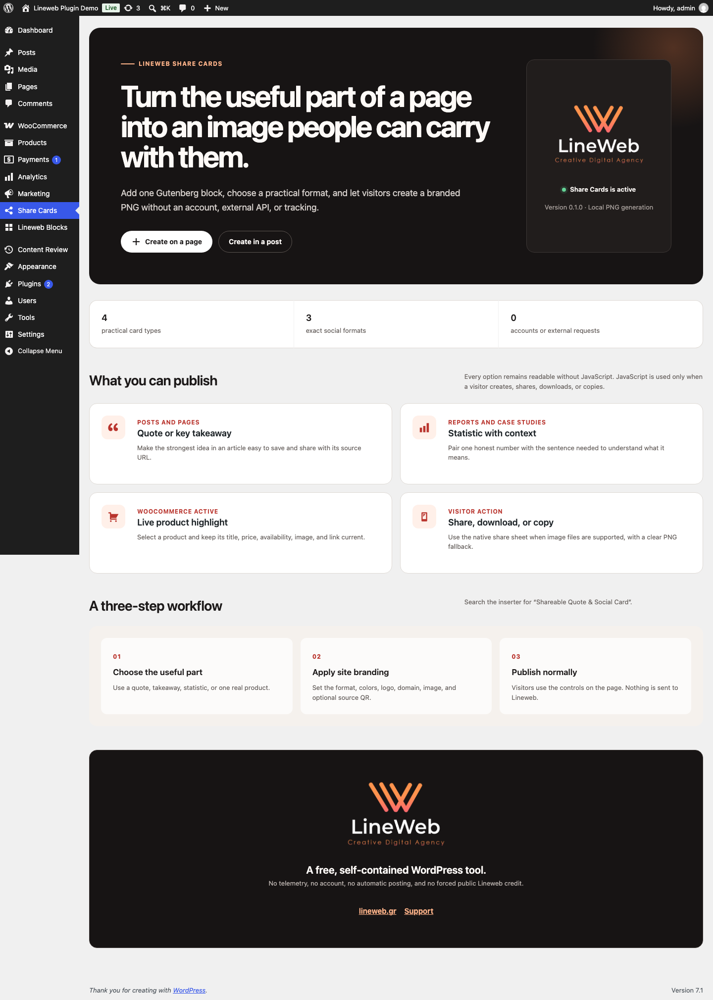
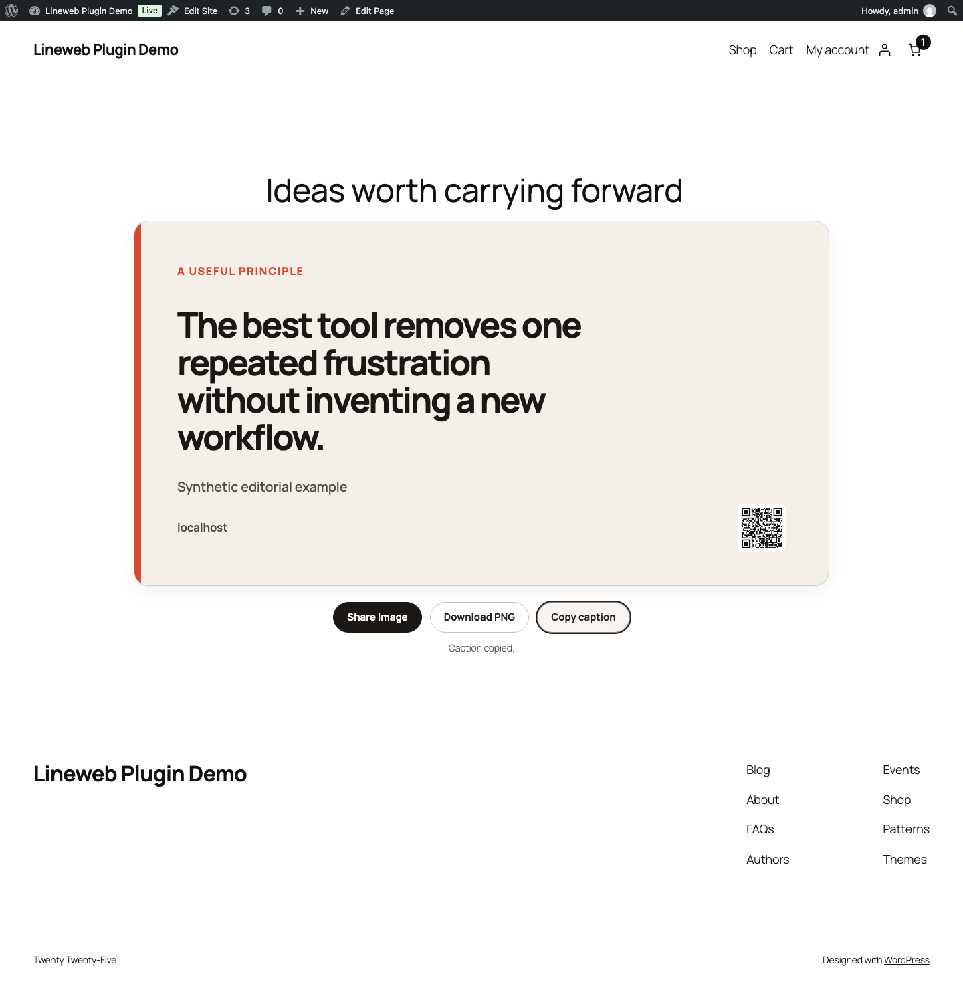
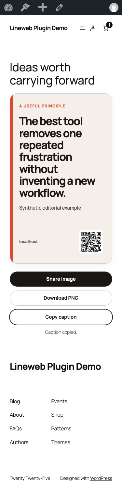
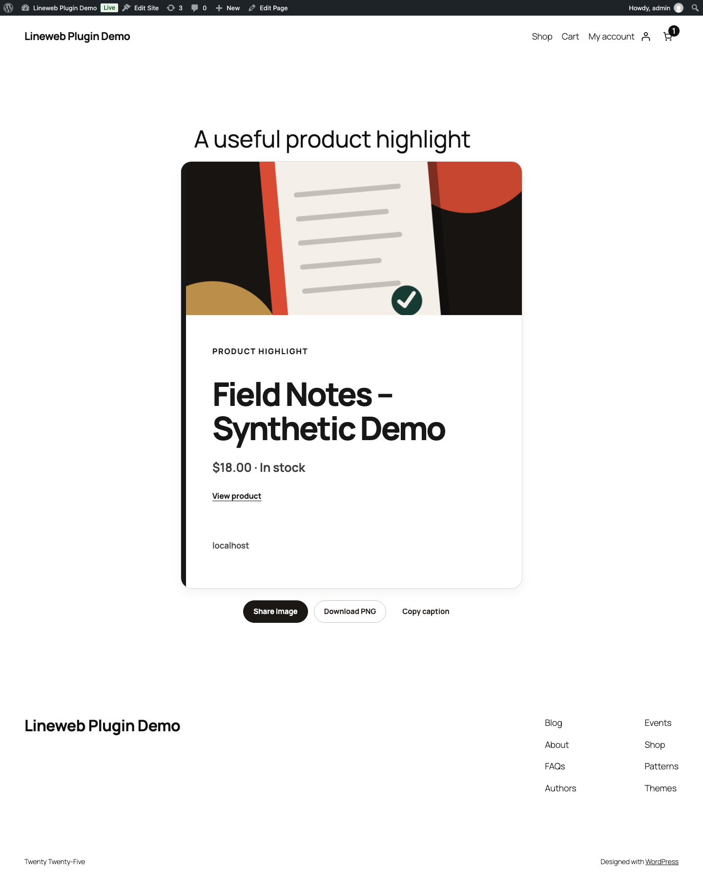

# WordPress Shareable Quote Image & Social Card Block

Lineweb Share Cards is a free Gutenberg block that turns a quote, key takeaway, statistic, or WooCommerce product into a branded PNG visitors can share or download.

The card remains readable as normal page content before JavaScript runs. PNG generation happens only after a visitor chooses an action and stays inside that visitor's browser. There is no account, telemetry, tracking pixel, external image service, or automatic social posting.

## Screenshots

All screenshots use synthetic demonstration content and a local WooCommerce product. No client, customer, order, or analytics data is included.










## What the block does

- **Quote:** a memorable statement with an optional author or source.
- **Key takeaway:** one practical conclusion from a post, guide, or page.
- **Statistic:** one number paired with the context needed to understand it.
- **WooCommerce product:** one manually selected, published, catalog-visible product with its live title, price, stock state, image, and link.
- **Exact image formats:** square 1080 × 1080, portrait 1080 × 1350, and landscape 1200 × 630.
- **Site attribution:** optional logo, domain, and source-page QR code. All are controlled by the editor.
- **Visitor actions:** native image sharing where the browser supports file sharing, plus reliable PNG download and caption copy fallbacks.

## Practical workflow

1. Edit a post, page, product, or buying guide in the block editor.
2. Insert **Shareable Quote & Social Card**.
3. Choose Quote, Key takeaway, Statistic, or WooCommerce product.
4. Select a square, portrait, or landscape format and adjust the restrained style controls.
5. Decide whether the PNG should include the site logo, domain, and source QR code.
6. Publish normally. Visitors can then share, download, or copy from the page.

The WooCommerce option is manual by design. The plugin never inserts promotional cards into product, Cart, Checkout, or Mini-Cart locations automatically.

## Honest sharing behavior

Browser and operating-system support differs. The **Share image** action uses the Web Share API only when the browser confirms that PNG files can be shared. Otherwise, the same action downloads the generated PNG and explains what happened. A separate download action is always available.

The plugin does not claim that a visitor completed a share. It records no share counts, profiles, referrals, or analytics events.

Media Library images normally share the site's origin and can be included in the PNG. If a site serves an image from another domain without browser CORS permission, the readable card still works but the browser omits that image from the exported PNG.

## Performance and privacy

- Frontend CSS and the small image-generation module load only on pages containing the block.
- No React runtime is added to the frontend.
- Quote, takeaway, and statistic cards require no database queries beyond the page itself.
- Product cards resolve one selected product through WooCommerce CRUD during server rendering.
- Images are created with the browser Canvas API. Nothing is uploaded to Lineweb or another service.
- QR codes are generated locally from the published page URL.

## Requirements

- WordPress 6.9 or newer
- PHP 8.3 or newer
- WooCommerce 10.8.1 or newer only for live product cards

Quote, takeaway, and statistic cards work without WooCommerce.

## Installation

1. Upload the plugin ZIP from **Plugins → Add New → Upload Plugin**.
2. Activate **Shareable Quote Images & Social Cards – Lineweb Share Cards**.
3. Open **Share Cards** in WordPress administration for the quick guide.
4. Edit content and insert **Shareable Quote & Social Card**.

## Deliberate boundaries

Lineweb Share Cards does not:

- post automatically to a social network;
- require or create a social account;
- fetch remote templates, fonts, logos, or tracking scripts;
- promise reach, engagement, conversion, or virality;
- add forced Lineweb credit to public cards;
- turn arbitrary page screenshots into images;
- store generated PNG files or visitor captions;
- insert product promotions automatically.

## Development

```bash
npm install
npm run build
npm run lint:js
npm run lint:css
npm run lint:php
npm run test:unit
```

The repository also contains a real WordPress browser journey, two-theme checks, RTL output validation, release-ZIP installation, Plugin Check, and WordPress/PHP/WooCommerce compatibility jobs.

## Third-party notice

The compiled frontend module includes `qrcode`, Copyright (c) 2012 Ryan Day, under the MIT License. The complete notice is also included in `readme.txt`, which ships inside every release ZIP.

## Support and security

Read the shared [support policy](SUPPORT.md). For reproducible support requests, use the [Lineweb contact form](https://lineweb.gr/contact/) and include the plugin version, WordPress version, theme, selected card type, and browser.

Report suspected vulnerabilities privately as described in the [security policy](SECURITY.md). Do not include credentials, customer data, or production database exports.

## License

GPL-2.0-or-later.
